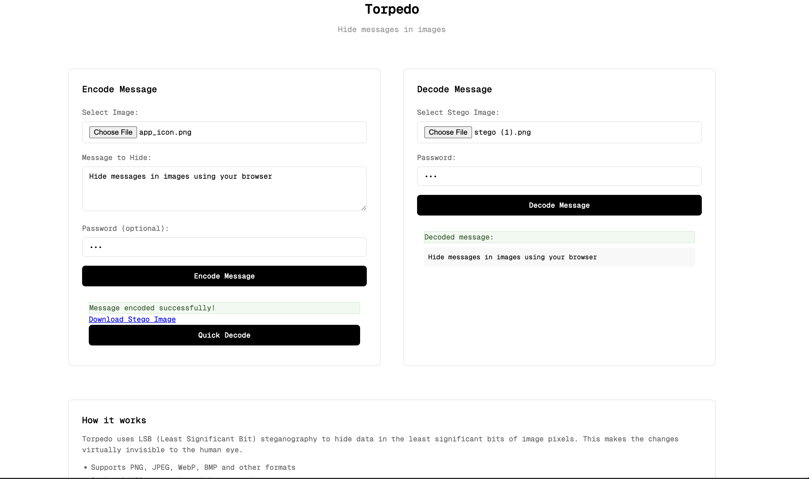

# Torpedo: Simple Steganography Toolkit

A lightweight steganography tool that hides data in images using LSB (Least Significant Bit) technique with optional XOR encryption.

**[Try it online](https://jeffasante.github.io/torpedo/web/)**



## What is Steganography?

Steganography is the art and science of concealing a message, image, or file within another message, image, or file. The word comes from Greek words στεγανός (covered) and γράφω (write). Unlike cryptography which makes messages unreadable, steganography hides the existence of the message entirely.

**Key Concepts:**
- **Payload**: The data being hidden
- **Carrier**: The file that hides the payload
- **Steganalysis**: The detection and analysis of hidden data

Steganography has legitimate uses like digital watermarking for intellectual property protection, but also poses security risks when used maliciously for covert communication.

## Features

- **LSB Steganography**: Hide data in the least significant bits of image pixels
- **XOR Encryption**: Optional password-based encryption for hidden data
- **Multi-Format Support**: PNG, JPEG, WebP, BMP, GIF and more (web version)
- **Cross-Platform**: Native C binary and WebAssembly for browsers
- **Quick Decode**: One-click verification of encoded messages

## Quick Start

### Native CLI

```bash
make
./torpedo encode -i photo.bmp -o stego.bmp -m "Secret message"
./torpedo decode -i stego.bmp
```

### Web Version

```bash
# Install Emscripten
git clone https://github.com/emscripten-core/emsdk.git
cd emsdk && ./emsdk install latest && ./emsdk activate latest
source ./emsdk_env.sh

# Build WebAssembly
cd torpedo && ./build_wasm.sh

# Serve locally
python3 -m http.server 8000
# Open: http://localhost:8000/web/index.html
```

## Commands

- `encode` - Hide data in an image
- `decode` - Extract hidden data from an image  
- `info` - Show image information and capacity

## Options

- `-i, --input FILE` - Input image
- `-o, --output FILE` - Output file
- `-d, --data FILE` - Data file to hide
- `-m, --message TEXT` - Text message to hide
- `-p, --password PASS` - Encryption password

## Technical Details

**Algorithm**: LSB (Least Significant Bit) steganography replaces the least significant bit of each color channel with data bits. Capacity is approximately 1 byte per 8 pixels.

**Format**: Stores data size (4 bytes) followed by the actual data, with optional XOR encryption.

**Limitations**: 
- Native CLI supports BMP only
- Web version supports PNG, JPEG, WebP, BMP, GIF and all browser-supported formats
- Basic XOR encryption (educational purposes)

## Security Notice

This tool is for educational and demonstration purposes. The XOR encryption is not cryptographically secure and should not be used for protecting sensitive data in production environments.

---

*Reference: [steganography.ch](https://www.steganography.ch) - Comprehensive resource on steganography techniques and applications*